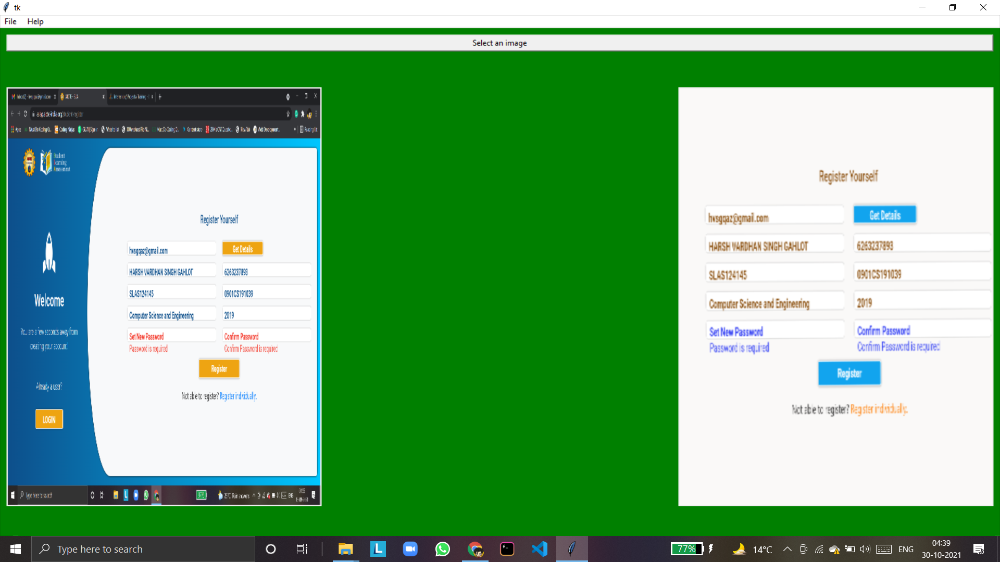

# DcoumentScanner
A document scanner application for laptops/desktops developed using python, Tkinter and OpenCV.
- Directly install the .exe file to install the application.
- Too see what'll get installed you can check the in the Installed files folder.
- After installing you can, double click the ImageScanner1 application to run the application.

